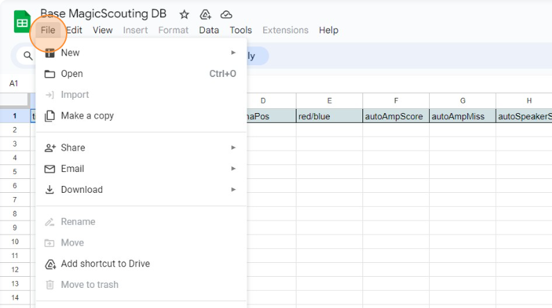
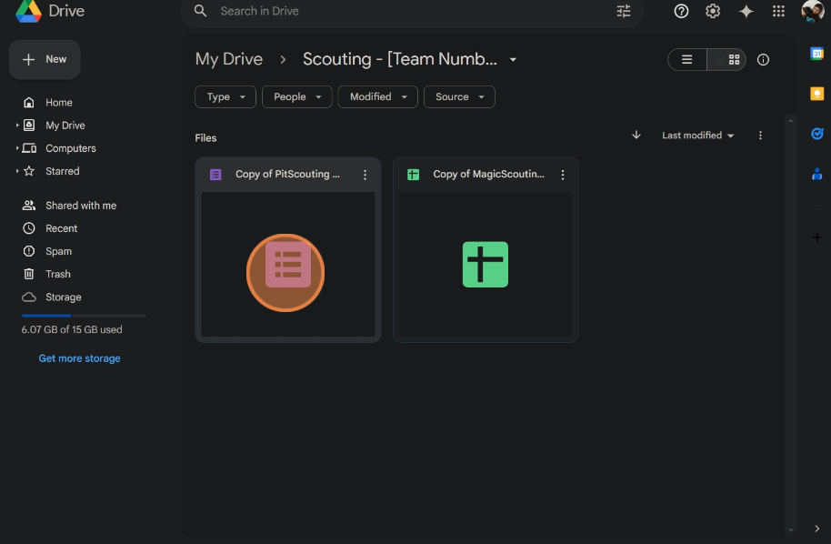
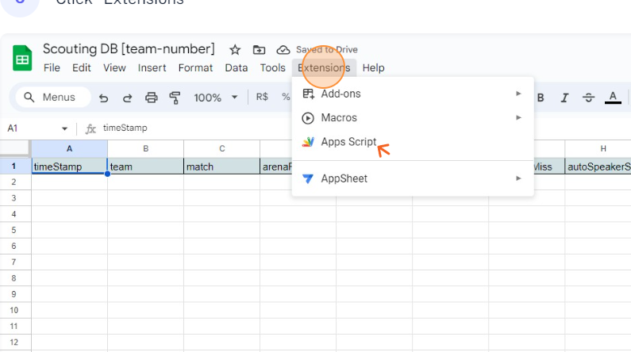
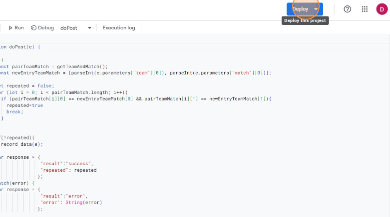
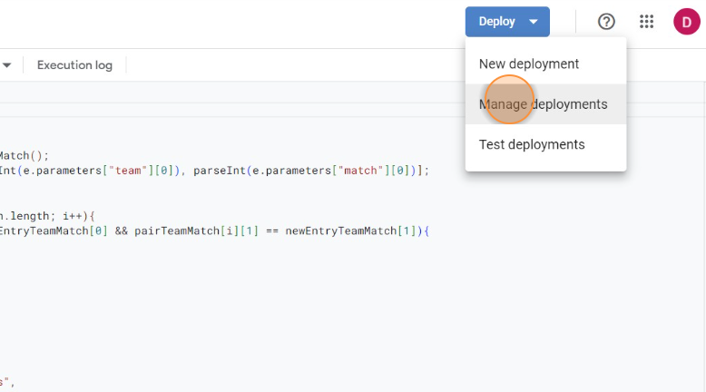
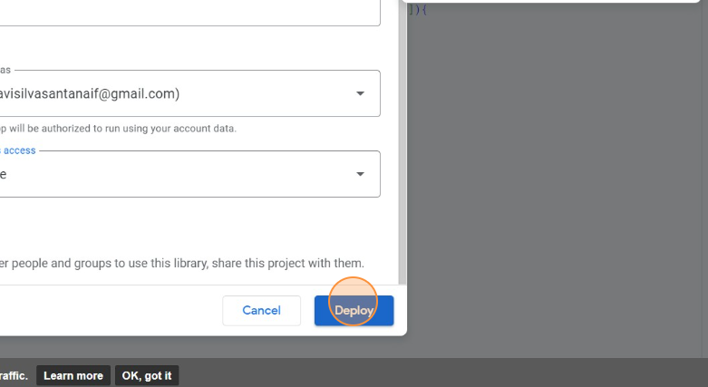
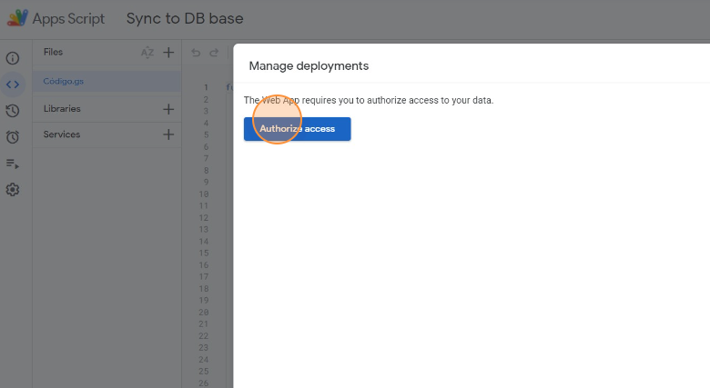

# Tutorial setup DB to MagicScouting DB

Refazer o guia no stripe com imagens em inglês
Fazer a página inicial do README
Mudar o logo para SVG
Criar um readme para cada página
Pensar em uma estrutura de wiki
Criar documentação sobre como fazer build do apk do código

1. First navigate to [Navigate to https://docs.google.com/spreadsheets/d/1UJSpJfSC_g9Sw5jJv3QAlookCk0J1dQea8edINo33nU/edit#gid=0](Navigate to https://docs.google.com/spreadsheets/d/1UJSpJfSC_g9Sw5jJv3QAlookCk0J1dQea8edINo33nU/edit#gid=0)
2. Click in "File"

   
  

3. Click "Make a copy"

   
  

4. Click Extensions > App Scripts

   
  

5. In a new tab, navigate to https://github.com/FRC5800/MagicScouting
     
6. Click "[AppScriptDB.gs](http://AppScriptDB.gs)"

   
  

7. Click copy raw file

   
  

8. Get back to the AppScript tab, remove all the code and paste the copied code

   
  

9. Click Save

   
  

10. Click deploy

   
  

11. Click "New deployment"

   
  

12. Click "settings"

   
  

13. Click WebApp

   
  

14. Click the "New description" field

   
  

15. Write "DB Sync" and then click who has access and select anyone

   
  

16. Click "Deploy"

   
  

17. Copy this link

   
  

18. Click in the 3 bars in the top left, click "database" and then paste the url

   
  

