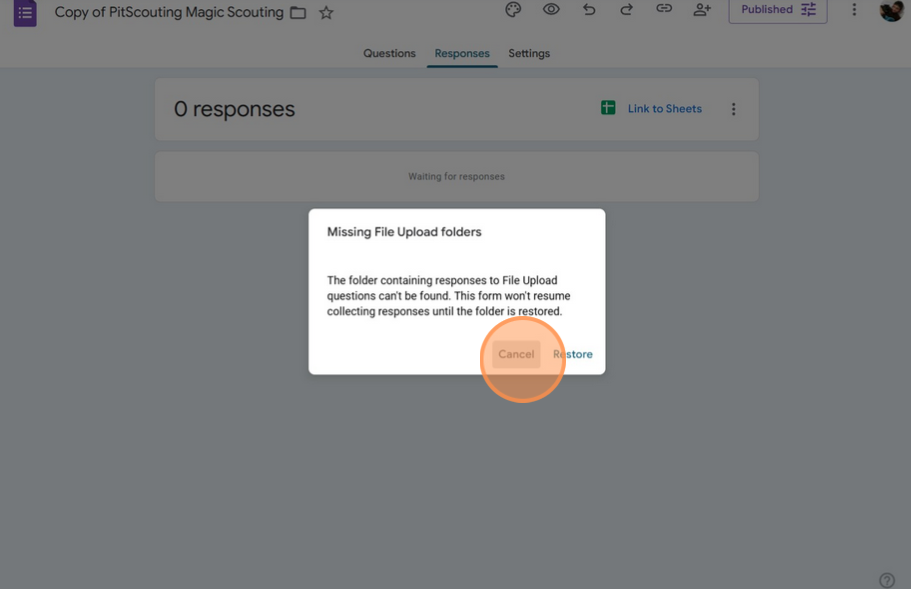
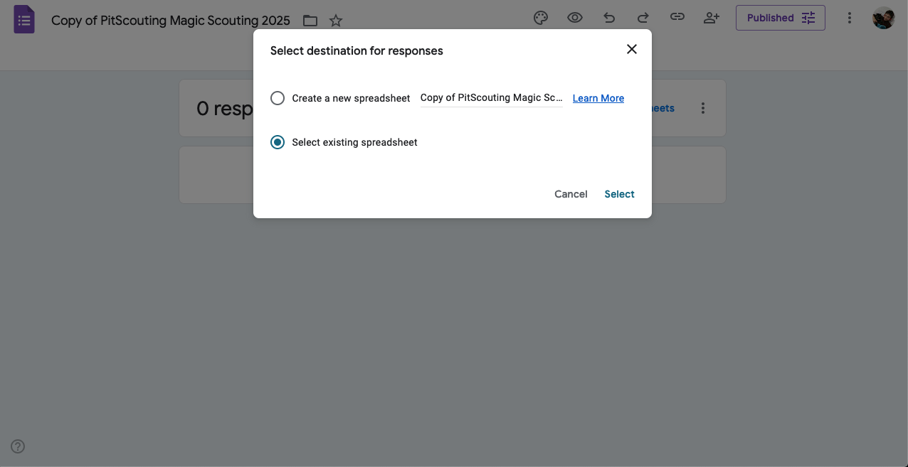
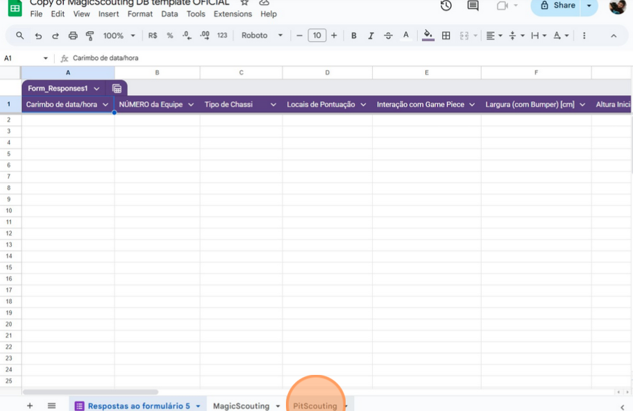
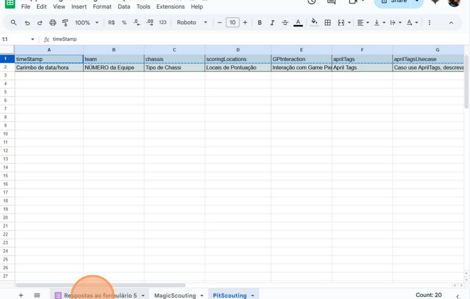
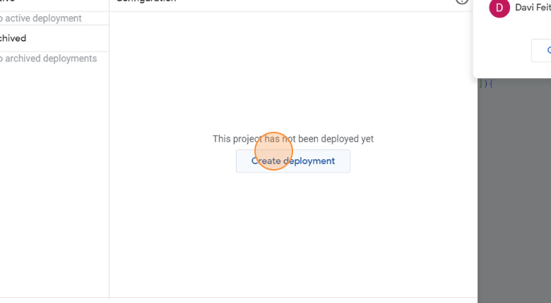
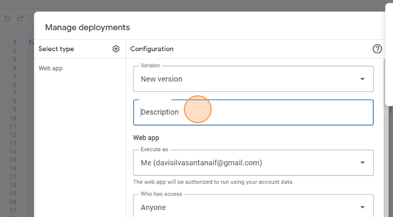

# Tutorial setup DB to MagicScouting DB

Refazer o guia no stripe com imagens em inglês
Fazer a página inicial do README
Mudar o logo para SVG
Criar um readme para cada página
Criar documentação sobre como fazer build do apk do código

1. Navigate to <https://docs.google.com/spreadsheets/d/1UJSpJfSC_g9Sw5jJv3QAlookCk0J1dQea8edINo33nU/edit#gid=0>
2. Click in "File"

  
    

3. Click "Make a copy"

  
    

4. Name it to "Scouting DB [team-number]"

  
    

5. Click "Make a copy"
  

  
    

6. Click Extensions > App Scripts
  

  
    

7. In the new tab click "Deploy".

  
    

8. Click "Manage deployments"

  
    

9. Click "Create deployment".

  
    

10. Click the "Description" field. > Type "sync"

  
    

11. Set access to "Anyone"

  
    

12. Click "Deploy"

  
    

13. Click "Authorize access".

  
    

14. Click "Copy"

  
    

15. Click "Done"

  
    

16. Now, open the MagicScouting > Click in the 3 bars in the top left > Click "database" and then paste the url

  
    

