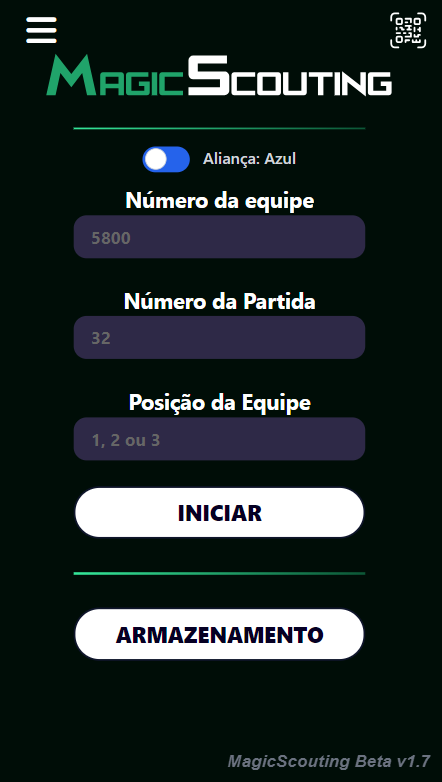
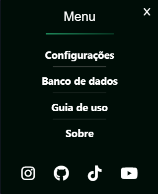
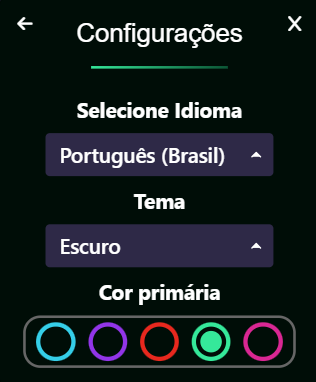
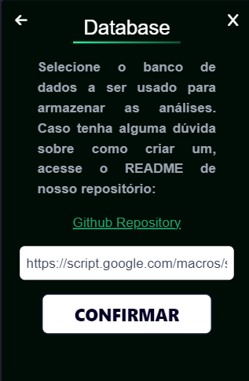

# Página Principal

  
    

Será vista logo após a abertura do aplicativo. Nela é possível preencher os campos de: número de equipe, número da partida e posição da equipe na arena. O botão de **Iniciar** só poderá ser pressionado após o preenchimento dos três campos.
A página inicial também conta com:

1. Botão de **Menu**: Abre o menu do aplicativo;
2. Botão de **Armazenamento**: Abre a página de armazenamento dos dados localmente;
3. Botão de **Scanner**: Abre o scanner de QR Code do aplicativo.

# Menu

  
    

O menu conta com 4 itens principais:

1. Aba de **Configurações**: Aba onde é possível configurar o idioma, tema e cor primária do aplicativo;
2. Aba de **Banco de Dados**: Aba onde deve ser colocado o link do banco de dados do sheets;
3. **Guia de Uso**: Link para esta documentação no Github;
4. **Sobre**: Aba contando brevemente sobre o projeto.

## Configurações

  
    

## Database

  
    

