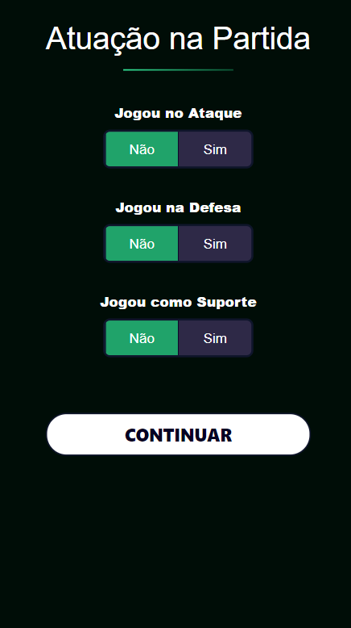

# Scouting Pages

## Autonomous

  
    

Após o início do scouting, a primeira página será relacionada ao modo autônomo, onde será possível analisar as 3 formas de pontuação presentes no autônomo: 
1. Pontuação no **Speaker**
2. Pontuação no **Amp**
3. Pontuação por meio do **Leave**

## TeleOp

Depois do modo autônomo, será possível analisar o modo *TeleOp*. O modo TeleOp conta com 3 formas de pontuação:
1. Pontuação no **Speaker**
2. Pontuação no **Speaker Amplificado**
3. Pontuação no **Amp**
Além da pontuação, é possível anotar o **tempo de ciclo** da equipe, ou seja, o tempo necessário para a equipe pegar uma GP (Game Piece) e pontuá-la. Depois de contabilizado o tempo, é possível descrever se o ciclo foi iniciado com a GP no chão ao pega na Source.

# Endgame
Presente na mesma página do modo TeleOp, o EndGame conta com 4 formas de análise:
1. High Notes: A quantidade de High Notes acertadas pelo Human Player da equipe (caso ele esteja nesta posição);
2. Trap: Contabiliza se a equipe fez ou não o ponto na Trap;
3. OnStage: Contabiliza se a equipe realizou o OnStage com sucesso ou não, além de contabilizar os pontos obtidos pela Harmony;
4. Ciclo de OnStage: contabiliza o tempo necessário para a equipe ser classificada como OnStage.

## Informações Adicionais

  
    

Logo após a página de TeleOp & EndGame, será possível descrever as funções desempenhadas pela equipe durante a partida, sendo as funções três: Ataque, Defesa e Suporte.

* **Ataque**: robô será caracterizado como atacante quando sua principal função no jogo for a da *pontuar*. Robôs atacantes são marcados pela capacidade de pontuar no **Speaker**, pois é a maior fonte de pontos do jogo;
* **Defesa**: robô será caracterizado como defensor quando sua principal função no jogo for a de *atrasar a pontuação* do time adversário;
* **Suporte**: robô será caracterizado como suporte quando sua principal função no jogo for a de garantir que os atacantes possam pontuar com máxima efetividade. Robôs de suporte são caracterizados pela capacidade de pontuar no **Amp**, pois ele maximiza a pontuação do atacante no Speaker.
  
***Observação:*** Um mesmo robô pode realizar mais de uma função por jogo, cabe ao scouter analisar o mesmo e decidir suas funções.