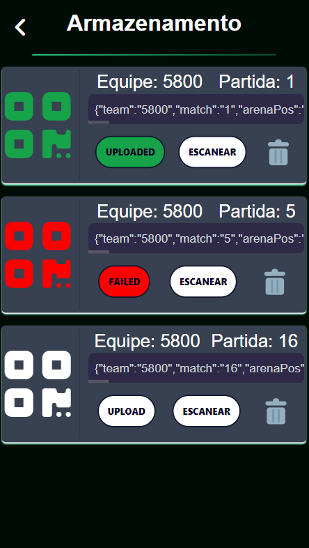
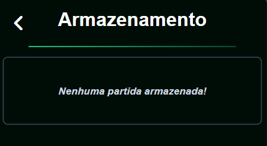

# Armazenamento

  
    

A página de armazenamento é onde as partidas ficam armazenadas caso não sejam escaneadas ou enviadas para a DB. A imagem acima mostra o layout da página. Quando clicado o botão de "Upload", o QR Code será enviado para o banco de dados. Caso a ação seja um sucesso, o ícone ficará verde, caso falha, ficará vermelho. Caso seja necessário escanear o QR Code, basta clicar no botão "Escanear", onde será mostrado o código na tela. Depois de escanear, clique na lixeira para apagar os dados (caso seja feito upload, os dados serão apagados ao sair da página).

Caso não hajam partidas armazenadas, a página mostrará o aviso abaixo:

  
    

